# AI Multi-Agent Resume Screening & Matching System

Create comprehensive resume screening and matching reports effortlessly with the power of AI. This project leverages multiple AI agents to collaboratively analyze job profiles and resumes, providing detailed matching scores and explanations through an intuitive **4-step wizard interface**.

In this repository, we demonstrate how to use **Semantic Kernel** to orchestrate Multi-Agent systems using **Azure OpenAI** models. We use a swarm agent architecture with **o1-mini** as the orchestrator and **gpt-4o-mini** model as the LLM for the task-oriented agents.

**Semantic Kernel** is utilized for agent orchestration, enabling seamless coordination and communication between different AI agents. By leveraging Semantic Kernel, the system efficiently manages task delegation, context sharing, and workflow automation, ensuring that each agent contributes effectively to the resume screening and matching process.

This repository is designed for **learning purposes**, offering insights into the development and integration of multi-agent systems for automated resume screening and candidate matching.

The diagram below shows how the orchestrator creates the agents and the expert agents collaborate with each other to accomplish the goal:

```mermaid
graph TD
    A[👤 User Input] --> B[📝 Job Profile]
    A --> C[📄 Resume Files]

    B --> D[🧠 Orchestrator Agent<br/>o1-mini]
    C --> D

    D --> E[🤖 Dynamic Agent Creation]

    E --> F[👨‍💼 Skills Analysis Agent<br/>gpt-4o-mini]
    E --> G[👩‍🎓 Experience Evaluation Agent<br/>gpt-4o-mini]
    E --> H[📚 Education Assessment Agent<br/>gpt-4o-mini]
    E --> I[🤝 Cultural Fit Agent<br/>gpt-4o-mini]
    E --> J[📊 Scoring & Ranking Agent<br/>gpt-4o-mini]

    F --> K[💬 Multi-Agent Collaboration]
    G --> K
    H --> K
    I --> K
    J --> K

    K --> L[📋 Comprehensive<br/>Screening Report]
    K --> M[🎯 Matching Scores<br/>& Rankings]

    L --> N[📊 Final Results<br/>Dashboard]
    M --> N

    style A fill:#e1f5fe
    style D fill:#fff3e0
    style K fill:#f3e5f5
    style N fill:#e8f5e8
```



The **Expert agents** are dynamically created and have a level of autonomy to accomplish their tasks. Each one will be responsible for a specific aspect of resume screening (skills analysis, experience evaluation, cultural fit assessment, etc.).

## ✨ New Enhanced User Interface

The system now features a modern, user-friendly **tab-based wizard interface** that guides users through the screening process:

### 🎯 4-Step Wizard Process
1. **📝 Job Profile** - Input job descriptions with intelligent validation
2. **📄 Resumes** - Upload and manage candidate files with enhanced previews  
3. **⚙️ Configuration** - Configure AI agents and analysis depth with helpful explanations
4. **🚀 Review & Start** - Review all inputs and initiate the screening process

### 🚀 UI Improvements
- **Progress Indicators**: Visual progress bar and step completion status
- **Smart Validation**: Real-time input validation with helpful feedback
- **Enhanced File Management**: Individual file controls, previews, and metadata display
- **Contextual Help**: Tooltips, examples, and guidance throughout the workflow
- **Professional Styling**: Modern, clean interface with consistent visual hierarchy
- **Responsive Design**: Works seamlessly across different screen sizes

## Features

This project framework provides the following enhanced features:

### 🤖 AI-Powered Analysis
* **Dynamic Agent Creation**: Automatically generates AI agents tailored to specific resume screening tasks
* **Collaborative AI**: Multiple AI agents work together to create comprehensive matching reports
* **Intelligent Matching**: AI-powered matching algorithms that analyze skills, experience, and cultural fit
* **Detailed Reports**: Generate comprehensive matching reports with scores and explanations

### 💻 Enhanced User Experience  
* **Tab-Based Wizard**: Intuitive 4-step process with progress tracking
* **Smart Validation**: Real-time input validation with character counting and helpful feedback
* **Enhanced File Management**: Individual file controls, metadata display, and content previews
* **Progress Indicators**: Visual progress bar and step completion status with checkmarks
* **Contextual Help**: Tooltips, examples, and guided explanations throughout

### 📊 File Processing & Management
* **Multi-Format Support**: Upload resumes in PDF, DOCX, and TXT formats
* **Batch Processing**: Handle multiple resumes simultaneously with drag-and-drop
* **File Metadata**: Display file type, size, and content previews
* **Individual Controls**: Remove specific files or clear all with one click

### 🔧 Configuration & Flexibility
* **Configurable Agents**: Choose 2-6 expert agents based on analysis needs
* **Analysis Depth Options**: Quick Overview, Standard Analysis, or Deep Dive modes
* **Job Profile Options**: Direct text input or URL processing (coming soon)
* **Real-time Feedback**: Live updates and status throughout the process

## 🎯 User Experience Demo

The system provides an enhanced **tab-based wizard interface** that guides users through the screening process:

### Step-by-Step Workflow:
1. **📝 Job Profile Tab**
   - Input detailed job descriptions with smart validation
   - Character counter and feedback for optimal description length
   - Real-time progress indicators showing completion status

2. **📄 Resumes Tab** 
   - Upload multiple resume files (PDF, DOCX, TXT) via drag-and-drop
   - Preview file contents with metadata (type, size, content preview)
   - Individual file management with remove/clear all options

3. **⚙️ Configuration Tab**
   - Select 2-6 expert agents with detailed explanations of each option
   - Choose analysis depth (Quick/Standard/Deep) with clear descriptions
   - Get recommendations for optimal settings

4. **🚀 Review & Start Tab**
   - Review all inputs before processing
   - Visual confirmation of job profile and uploaded resumes
   - One-click screening initiation with progress tracking

### Enhanced Visual Features:
- **Progress Bar**: Shows overall completion percentage across all steps
- **Step Indicators**: Visual checkmarks (✅) for completed sections  
- **Smart Feedback**: Contextual warnings, tips, and success messages
- **Professional Styling**: Clean, modern interface with consistent branding

## How It Works

### Multi-Agent Architecture
1. **Orchestrator Agent**: Creates specialized expert agents based on job requirements
2. **Skills Analysis Agent**: Evaluates technical and soft skills alignment
3. **Experience Evaluation Agent**: Assesses work experience relevance and depth
4. **Education Assessment Agent**: Reviews educational background and certifications
5. **Cultural Fit Agent**: Analyzes personality traits and team compatibility
6. **Report Compilation Agent**: Synthesizes all evaluations into final scores

### Screening Process
1. Job profile is analyzed to identify key requirements
2. Resumes are processed and text is extracted
3. Expert agents collaborate to evaluate each candidate
4. Matching scores are calculated with detailed explanations
5. Candidates are ranked and comprehensive reports are generated

## Getting Started

### Prerequisites

- Python 3.10+
- Azure OpenAI API Key
- Bing API Key (optional, for web search capabilities)

### Installation

1. Clone the repository:
    ```sh
    git clone [repository clone url]
    cd TFaimultiagentprsntnbuildr
    ```

2. Create and activate a virtual environment:
    ```sh
    python -m venv venv
    source venv/bin/activate  # On Windows: venv\Scripts\activate
    ```

3. Install the required Python packages:
    ```sh
    pip install -r requirements.txt
    ```
    
    Or using Poetry:
    ```sh
    poetry install
    ```

4. Set up environment variables:
    ```sh
    cp .env.example .env
    # Edit .env file with your API keys and configuration
    ```

### Configuration

Edit the `.env` file with your configuration:

```env
# Azure OpenAI Configuration
AZURE_OPENAI_ENDPOINT=your_azure_openai_endpoint
AZURE_OPENAI_API_KEY=your_azure_openai_api_key
AZURE_OPENAI_MODEL=gpt-4o-mini
AZURE_OPENAI_MODEL_ORCHESTRATOR=o1-mini

# Bing Search Configuration (optional)
BING_API_KEY=your_bing_api_key

# Template Configuration
TEMPLATE_DIR_PROMPTS=src/prompts
TEMPLATE_SYSTEM_ORCHESTRATOR=orchestrator.jinja
TEMPLATE_SELECTION=selection.jinja
TEMPLATE_TERMINATION=termination.jinja
```

### Usage

1. **Run the application**:
    ```sh
    streamlit run app.py
    ```
    
    Or using the main entry point:
    ```sh
    python main.py
    ```

2. **Access the web interface**:
    Open your browser and go to `http://localhost:8501`

3. **Follow the 4-step wizard**:
    
    **Step 1: 📝 Job Profile**
    - Choose between direct text input or URL (coming soon)
    - Paste your complete job description with requirements, skills, and qualifications
    - Watch the character counter for optimal length feedback
    
    **Step 2: 📄 Resumes** 
    - Upload resume files using drag-and-drop or file browser
    - Supported formats: PDF, DOCX, TXT
    - Preview uploaded files and manage them individually
    
    **Step 3: ⚙️ Configuration**
    - Select number of expert agents (2-6, recommended: 4)
    - Choose analysis depth based on your needs
    - Review helpful explanations for each option
    
    **Step 4: 🚀 Review & Start**
    - Review your job profile and uploaded resumes
    - Verify configuration settings
    - Click "Start Resume Screening" to begin AI analysis
    - Monitor real-time progress and agent status

4. **View Results**:
    - Comprehensive matching scores for each candidate
    - Detailed explanations and reasoning from expert agents
    - Ranked candidate list with strengths and areas of concern

### Testing

Run the test script to verify the system:
```sh
python test_system.py
```

3. Set up your environment variables:
    - Copy  to  and fill in your API keys and other configurations.
    - You can use the [.env.sample](.env.sample) file to adjust your own environment variables. Rename the file to `.env` and change each one with your own data.

### Quickstart

1. Run the Streamlit app:
    ```sh
    streamlit run app.py
    ```

2. Open your browser and navigate to `http://localhost:8501`.

3. Enter a theme for your presentation and let the AI agents do the rest!

## 🚀 Demo

A comprehensive demo showcases the enhanced user interface and AI-powered screening capabilities.

### Quick Demo Steps:

1. **Prerequisites**: Ensure all requirements are met and environment variables are configured
2. **Launch**: Run `streamlit run app.py` and navigate to `http://localhost:8501`
3. **Experience**: Follow the intuitive 4-step wizard to screen resumes with AI agents

### Sample Workflow:
- **Job Profile**: Use a sample job description like "Senior Software Engineer with 5+ years Python experience"
- **Resumes**: Upload test resume files in various formats
- **Configuration**: Try different agent counts and analysis depths
- **Results**: View detailed AI-generated matching reports with scores and explanations

The enhanced interface makes it easy to understand the screening process and get professional-quality results.

## Resources

- [Azure OpenAI Documentation](https://learn.microsoft.com/en-us/azure/cognitive-services/openai/)
- [Streamlit Documentation](https://docs.streamlit.io/)
- [Jinja Documentation](https://jinja.palletsprojects.com/)

## Contributing

This project welcomes contributions and suggestions. Please open a PR and it will be analyzed as soon as possible.

## License

This project is licensed under the MIT License. See the  file for details.
