# AI Multi-Agent Resume Screening & Matching System

Create comprehensive resume screening and matching reports effortlessly with the power of AI. This project leverages multiple AI agents to collaboratively analyze job profiles and resumes, providing detailed matching scores and explanations through an intuitive **4-step wizard interface**.

In this repository, we demonstrate how to use **Semantic Kernel** to orchestrate Multi-Agent systems using **Azure OpenAI** models. We use a swarm agent architecture with **o1-mini** as the orchestrator and **gpt-4o-mini** model as the LLM for the task-oriented agents.

**Semantic Kernel** is utilized for agent orchestration, enabling seamless coordination and communication between different AI agents. By leveraging Semantic Kernel, the system efficiently manages task delegation, context sharing, and workflow automation, ensuring that each agent contributes effectively to the resume screening and matching process.

This repository is designed for **learning purposes**, offering insights into the development and integration of multi-agent systems for automated resume screening and candidate matching.

The diagram below shows how the orchestrator creates the agents and the expert agents collaborate with each other to accomplish the goal:

```mermaid
graph TD
    A[👤 User Input] --> B[📝 Job Profile]
    A --> C[📄 Resume Files]

    B --> D[🧠 Orchestrator Agent<br/>o1-mini]
    C --> D

    D --> E[🤖 Dynamic Agent Creation]

    E --> F[👨‍💼 Skills Analysis Agent<br/>gpt-4o-mini]
    E --> G[👩‍🎓 Experience Evaluation Agent<br/>gpt-4o-mini]
    E --> H[📚 Education Assessment Agent<br/>gpt-4o-mini]
    E --> I[🤝 Cultural Fit Agent<br/>gpt-4o-mini]
    E --> J[📊 Scoring & Ranking Agent<br/>gpt-4o-mini]

    F --> K[💬 Multi-Agent Collaboration]
    G --> K
    H --> K
    I --> K
    J --> K

    K --> L[📋 Comprehensive<br/>Screening Report]
    K --> M[🎯 Matching Scores<br/>& Rankings]

    L --> N[📊 Final Results<br/>Dashboard]
    M --> N

    style A fill:#e1f5fe
    style D fill:#fff3e0
    style K fill:#f3e5f5
    style N fill:#e8f5e8
```



The **Expert agents** are dynamically created and have a level of autonomy to accomplish their tasks. Each one will be responsible for a specific aspect of resume screening (skills analysis, experience evaluation, cultural fit assessment, etc.).

## ✨ New Enhanced User Interface

The system now features a modern, user-friendly **tab-based wizard interface** that guides users through the screening process:

### 🎯 4-Step Wizard Process

1. **📝 Job Profile** - Input job descriptions with intelligent validation
2. **📄 Resumes** - Upload and manage candidate files with enhanced previews
3. **⚙️ Configuration** - Configure AI agents and analysis depth with helpful explanations
4. **🚀 Review & Start** - Review all inputs and initiate the screening process

### 🚀 UI Improvements

- **Progress Indicators**: Visual progress bar and step completion status
- **Smart Validation**: Real-time input validation with helpful feedback
- **Enhanced File Management**: Individual file controls, previews, and metadata display
- **Contextual Help**: Tooltips, examples, and guidance throughout the workflow
- **Professional Styling**: Modern, clean interface with consistent visual hierarchy
- **Responsive Design**: Works seamlessly across different screen sizes

## Features

This project framework provides the following enhanced features:

### 🤖 AI-Powered Analysis

- **Dynamic Agent Creation**: Automatically generates AI agents tailored to specific resume screening tasks
- **Collaborative AI**: Multiple AI agents work together to create comprehensive matching reports
- **Intelligent Matching**: AI-powered matching algorithms that analyze skills, experience, and cultural fit
- **Detailed Reports**: Generate comprehensive matching reports with scores and explanations

### 💻 Enhanced User Experience

- **Tab-Based Wizard**: Intuitive 4-step process with progress tracking
- **Smart Validation**: Real-time input validation with character counting and helpful feedback
- **Enhanced File Management**: Individual file controls, metadata display, and content previews
- **Progress Indicators**: Visual progress bar and step completion status with checkmarks
- **Contextual Help**: Tooltips, examples, and guided explanations throughout
- **Rich Agent Monitoring**: Detailed agent cards showing specializations and real-time activities
- **Phase-Based Progress**: Clear distinction between analysis phases with contextual updates

### 📊 File Processing & Management

- **Multi-Format Support**: Upload resumes in PDF, DOCX, and TXT formats
- **Batch Processing**: Handle multiple resumes simultaneously with drag-and-drop
- **File Metadata**: Display file type, size, and content previews
- **Individual Controls**: Remove specific files or clear all with one click

### 🔧 Configuration & Flexibility

- **Configurable Agents**: Choose 2-6 expert agents based on analysis needs
- **Dynamic Round Calculation**: Automatically sets optimal analysis rounds based on agent count (2× per agent)
- **Analysis Depth Options**: Quick Overview, Standard Analysis, or Deep Dive modes
- **Job Profile Options**: Direct text input or URL processing (coming soon)
- **Real-time Progress**: Live updates showing current agent and round progress with detailed activities
- **Smart Termination**: Intelligent stopping conditions based on agent consensus
- **Agent Specialization**: Each agent has clearly defined expertise areas with role-specific activities

## 🎯 User Experience Demo

### 📹 Application Demo Video

Watch the complete application workflow in action:


_A comprehensive demonstration of the 4-step wizard interface, from job profile input to final screening results._

> **💡 Tip**: For better quality, you can also [watch the full video](https://github.com/umshere/ai-resume-screening-system/raw/feature/resume-screening-system/streamlit-app-demo-small.mp4) (MP4 format).

The system provides an enhanced **tab-based wizard interface** that guides users through the screening process:

### Step-by-Step Workflow:

1. **📝 Job Profile Tab**

   - Input detailed job descriptions with smart validation
   - Character counter and feedback for optimal description length
   - Real-time progress indicators showing completion status

2. **📄 Resumes Tab**

   - Upload multiple resume files (PDF, DOCX, TXT) via drag-and-drop
   - Preview file contents with metadata (type, size, content preview)
   - Individual file management with remove/clear all options

3. **⚙️ Configuration Tab**

   - Select 2-6 expert agents with detailed explanations of each option
   - Choose analysis depth (Quick/Standard/Deep) with clear descriptions
   - Get recommendations for optimal settings

4. **🚀 Review & Start Tab**
   - Review all inputs before processing
   - Visual confirmation of job profile and uploaded resumes
   - One-click screening initiation with intelligent progress tracking
   - Dynamic round calculation showing "Round X/Y" with current agent status
   - Real-time agent activity monitoring with detailed descriptions

### Enhanced Visual Features:

- **Progress Bar**: Shows overall completion percentage across all steps
- **Step Indicators**: Visual checkmarks (✅) for completed sections
- **Smart Feedback**: Contextual warnings, tips, and success messages
- **Professional Styling**: Clean, modern interface with consistent branding
- **Agent Activity Monitoring**: Live sidebar with agent specializations and current tasks
- **Phase-Based Updates**: Clear distinction between analysis phases with detailed status

## 🚀 Recent Major Improvements (June 2025)

### ⚡ Performance & Speed Optimizations

We've implemented significant performance improvements to reduce screening time from 8+ minutes to under 2 minutes:

- **Reduced Interaction Rounds**: Optimized from `2× agents` to `1× agents + 1` (e.g., 4 agents: 8→5 rounds)
- **Speed Mode Toggle**: New speed mode that limits agents to 3 and uses Quick Analysis
- **Gemini 2.5 Flash Lite**: Integrated latest high-speed model with optimized generation settings
- **Smart Defaults**: Default to 3 agents and Quick Overview for faster processing
- **Optimized Progress**: Streamlined phase names and reduced API calls

### 🎯 Fixed Critical Scoring Issues

**Major Fix**: Resolved inflated scoring where unqualified candidates were getting 80%+ matches:

- **Realistic Scoring**: Student with only internships now scores ~27% for Engineering Manager role (was 80%)
- **Stricter Defaults**: Reduced generous default scores (Skills: 80%→40%, Experience: 75%→30%)
- **Role Level Validation**: New 25% weight component that checks candidate seniority vs job requirements
- **Enhanced Skill Matching**: Improved technical and management skill recognition
- **Better Experience Parsing**: Enhanced extraction of years and role levels from resumes

### 📊 Enhanced Scoring Algorithm

Our improved plugin now provides much more accurate assessments:

```python
# NEW Weighted Scoring (More Accurate)
overall_score = (skill_score * 0.35) + (experience_score * 0.25) + 
                (education_score * 0.15) + (role_match_score * 0.25)

# Role Level Matching Examples:
# Management role + Student candidate = 10% role match
# Management role + Senior Engineer = 60% role match  
# Management role + Engineering Manager = 90% role match
```

### 📈 Real Results Comparison

| Candidate Type | Old Score | New Score | Accuracy |
|---|---|---|---|
| **Student (Internships only)** | 80% 😱 | 27% ✅ | Much Better |
| **Qualified Engineering Manager** | 85% | 71% ✅ | Realistic |
| **Senior Developer** | 75% | 65% ✅ | Appropriate |

### 🔧 Technical Improvements

- **Fixed Mock Data**: Replaced hardcoded sample results with actual agent analysis
- **Enhanced Report Generation**: New CSV and PDF download functionality with detailed breakdowns
- **Better Agent Integration**: All agents now use improved plugin scoring as foundation
- **Improved Error Handling**: Better graceful failures and user feedback
- **Context Length Optimization**: Reduced token usage while maintaining quality

### 🎨 UI/UX Enhancements

- **Real-time Results**: Display actual agent analysis instead of mock data
- **Detailed Breakdown**: Shows individual component scores (Skills, Experience, Education, Role Match)
- **Speed Mode Interface**: Visual indicators for speed optimizations
- **Better Progress Feedback**: More accurate time estimates and phase descriptions
- **Enhanced Download**: Comprehensive CSV reports with all scoring details

## How It Works

### Multi-Agent Architecture

1. **Orchestrator Agent**: Creates specialized expert agents based on job requirements
2. **Skills Analysis Agent**: Evaluates technical and soft skills alignment
3. **Experience Evaluation Agent**: Assesses work experience relevance and depth
4. **Education Assessment Agent**: Reviews educational background and certifications
5. **Cultural Fit Agent**: Analyzes personality traits and team compatibility
6. **Report Compilation Agent**: Synthesizes all evaluations into final scores

### Screening Process

The system processes resumes through multiple collaborative agent rounds with detailed activity tracking:

1. **Dynamic Agent Creation**: Orchestrator creates specialized agents based on job requirements
2. **Intelligent Round Calculation**: System calculates optimal analysis rounds (2× per agent, minimum 4)
3. **Agent Specialization**: Each agent focuses on their specific expertise area with detailed activities
4. **Phase-Based Analysis**: Agents work through "Initial Analysis" and "Deep Analysis & Validation" phases
5. **Real-time Monitoring**: Live updates showing exactly what each agent is analyzing
6. **Smart Termination**: Process completes when agents reach consensus or max rounds

### 📊 Enhanced Progress Tracking & Agent Insights

The system now features **intelligent progress tracking** with detailed agent activity monitoring:

- **Dynamic Rounds**: For 2 agents = 4 rounds, for 3 agents = 6 rounds, etc.
- **Agent Specialization Display**: Each agent shows their specific expertise area
- **Detailed Activity Descriptions**: Real-time updates of what each agent is analyzing
- **Phase Indicators**: Shows "Initial Analysis" vs "Deep Analysis & Validation" phases
- **Rich Agent Cards**: Sidebar displays with agent roles and current activities

#### Agent Specializations:

- **🔧 Skills Analysis Agent**: Technical skills & expertise evaluation
- **📈 Experience Evaluation Agent**: Work experience & career assessment
- **🎓 Education Assessment Agent**: Educational background analysis
- **🤝 Cultural Fit Agent**: Team & cultural alignment evaluation
- **👑 Leadership Assessment Agent**: Leadership & management capabilities
- **🔬 Technical Depth Agent**: Deep technical expertise analysis

#### Example Enhanced Progress Display:

```
Round 2/4 | Experience_Evaluation_Agent | 2 agents total | Initial Analysis
🎯 Evaluating work experience relevance for 3 candidate(s)

Sidebar Agent Card:
👤 Skills_Analysis_Agent
🔧 Technical Skills & Expertise
🔍 Cross-referencing skill requirements with candidate experience
```

## Getting Started

### Prerequisites

- Python 3.10+
- **One of the following AI service options:**
  - **Azure OpenAI API Key** (Microsoft's hosted OpenAI service)
  - **OpenAI API Key** (Direct OpenAI API access)
  - **Google Gemini API Key** (Google's AI service - **recommended for cost efficiency**)
  - **Local LLM Server** (Your own AI model running locally - **zero cost**)
- Bing API Key (optional, for web search capabilities)

### AI Service Options

This system supports **four AI services** - choose the one that best fits your needs:

#### 🌟 **Google Gemini (Recommended)**

- **Most cost-effective option**
- **High performance** with Gemini-1.5-Flash
- **Easy setup** with Google AI Studio
- **No subscription required** - pay per use

#### 🔷 **Azure OpenAI**

- **Enterprise-grade** security and compliance
- **Integrated with Microsoft ecosystem**
- **Requires Azure subscription**

#### 🔸 **OpenAI (Direct)**

- **Direct access** to OpenAI's latest models
- **Simple API setup**
- **Requires OpenAI account**

#### 🏠 **Local LLM (Zero Cost)**

- **Completely free** - runs on your hardware
- **Full privacy** - data never leaves your machine
- **Works with** LM Studio, Ollama, or any OpenAI-compatible server
- **No internet required** once models are downloaded

### Installation

1. Clone the repository:

   ```sh
   git clone [repository clone url]
   cd TFaimultiagentprsntnbuildr
   ```

2. Create and activate a virtual environment:

   ```sh
   python3 -m venv venv
   source venv/bin/activate  # On Windows: venv\Scripts\activate
   ```

3. Install the required Python packages:

   ```sh
   pip install -r requirements.txt
   ```

   Or using Poetry:

   ```sh
   poetry install
   ```

4. Set up environment variables:

   **Quick Setup (Recommended):**

   ```sh
   ./setup.sh
   ```

   **Manual Setup:**

   ```sh
   cp .env.example .env
   # Edit .env file with your API keys and configuration
   ```

### Configuration

The system supports **multiple AI services**. Choose one and configure it in your `.env` file:

**Quick Setup**: Copy the example file and edit with your preferences:

```sh
cp .env.example .env
# Edit .env file with your chosen AI service and credentials
```

#### 🌟 **Option 1: Google Gemini (Recommended) - NEW: 2.5 Flash Lite**

**Fast & Cost-Effective** - Latest Gemini 2.5 Flash Lite model optimized for speed:

```env
AI_SERVICE=gemini
GEMINI_API_KEY=your-actual-gemini-api-key-here
GEMINI_MODEL=gemini-2.5-flash-lite-preview-06-17
GEMINI_MODEL_ORCHESTRATOR=gemini-2.5-flash-lite-preview-06-17
```

✅ **Benefits**: Ultra-fast processing (~2 minutes), excellent accuracy, cost-effective

#### 🏠 **Option 2: Local LLM (Zero Cost)**

```env
AI_SERVICE=local
LOCAL_LLM_BASE_URL=http://localhost:1234/v1
LOCAL_LLM_MODEL=your-model-name
```

#### 🔷 **Option 3: Azure OpenAI**

```env
AI_SERVICE=azure
AZURE_OPENAI_ENDPOINT=https://your-resource-name.openai.azure.com/
AZURE_OPENAI_API_KEY=your-azure-openai-api-key-here
```

#### 🔸 **Option 4: OpenAI Direct**

```env
AI_SERVICE=openai
OPENAI_API_KEY=sk-your-openai-api-key-here
```

💡 **See `.env.example` for complete configuration options and detailed comments.**

### Quick Setup Guide

#### 🌟 **Gemini Setup (Recommended)**

1. **Get API Key**: Visit [Google AI Studio](https://aistudio.google.com/app/apikey)
2. **Create new API key** (free - no credit card required)
3. **Copy the key** and add to your `.env` file:
   ```env
   AI_SERVICE=gemini
   GEMINI_API_KEY=your-actual-api-key-here
   ```
4. **Run the app** - you're ready to go!

#### 🔷 **Azure OpenAI Setup**

1. **Create Azure OpenAI resource** in Azure Portal
2. **Deploy models** (gpt-4o-mini recommended)
3. **Copy endpoint and API key** to `.env` file
4. **Set AI_SERVICE=azure**

#### 🔸 **OpenAI Direct Setup**

1. **Create OpenAI account** at [OpenAI Platform](https://platform.openai.com)
2. **Generate API key** in your dashboard
3. **Add to .env file** with `AI_SERVICE=openai`

#### 🏠 **Local LLM Setup (Zero Cost)**

1. **Install a local LLM server** (choose one):

   - **LM Studio**: [lmstudio.ai](https://lmstudio.ai) - Easy GUI interface
   - **Ollama**: [ollama.ai](https://ollama.ai) - Command line tool
   - **Text Generation WebUI**: Advanced option for power users

2. **Download a model** (recommended models):

   - **Gemma 2 2B/9B**: Fast and efficient
   - **Llama 3.1 8B**: High quality responses
   - **Mistral 7B**: Good balance of speed and quality

3. **Start the server** on `http://localhost:1234` (default for LM Studio)

4. **Configure .env file**:

   ```env
   AI_SERVICE=local
   LOCAL_LLM_BASE_URL=http://localhost:1234/v1
   LOCAL_LLM_MODEL=your-model-name
   ```

5. **Test connection**:
   ```sh
   python test_local_llm.py
   ```

### Usage

1. **Run the application**:

   ```sh
   streamlit run app.py
   ```

   Or using the main entry point:

   ```sh
   python main.py
   ```

2. **Access the web interface**:
   Open your browser and go to `http://localhost:8501`

3. **Follow the 4-step wizard**:

   **Step 1: 📝 Job Profile**

   - Choose between direct text input or URL (coming soon)
   - Paste your complete job description with requirements, skills, and qualifications
   - Watch the character counter for optimal length feedback

   **Step 2: 📄 Resumes**

   - Upload resume files using drag-and-drop or file browser
   - Supported formats: PDF, DOCX, TXT
   - Preview uploaded files and manage them individually

   **Step 3: ⚙️ Configuration**

   - Select number of expert agents (2-6, recommended: 4)
   - Choose analysis depth based on your needs
   - Review helpful explanations for each option

   **Step 4: 🚀 Review & Start**

   - Review all inputs before processing
   - Visual confirmation of job profile and uploaded resumes
   - One-click screening initiation with intelligent progress tracking
   - Dynamic round calculation showing "Round X/Y" with current agent status

4. **View Results**:
   - Comprehensive matching scores for each candidate
   - Detailed explanations and reasoning from expert agents
   - Ranked candidate list with strengths and areas of concern

### Testing & Troubleshooting

#### Quick Test

Run our configuration test to verify your setup:

```sh
python test_ai_config.py
```

This will verify:

- ✅ Environment variables are loaded correctly
- ✅ AI service is properly configured
- ✅ API keys are valid and working
- ✅ System can make successful API calls

#### Common Issues & Solutions

**❌ "Missing credentials" error**

- Check that you've set `AI_SERVICE` in your `.env` file
- Verify the corresponding API key is set (e.g., `GEMINI_API_KEY` for Gemini)
- Ensure your `.env` file is in the project root directory

**❌ "Invalid API key" error**

- Double-check your API key is copied correctly (no extra spaces)
- For Gemini: Verify key at [Google AI Studio](https://aistudio.google.com/app/apikey)
- For OpenAI: Check your key at [OpenAI Platform](https://platform.openai.com/api-keys)

**❌ "Bing Search disabled" warning**

- This is normal! Bing Search is optional
- The system works perfectly without it
- Add `BING_API_KEY` only if you need web search features

#### Performance Tips

- **Gemini**: Fastest and most cost-effective for most use cases
- **Azure OpenAI**: Best for enterprise environments with compliance needs
- **OpenAI Direct**: Good balance of features and performance

### Testing

Run the comprehensive test suite to verify everything works:

```sh
# Test AI configuration
python test_ai_config.py

# Test Gemini integration specifically
python test_gemini.py

# Test complete system workflow
python test_system.py
```

3. Set up your environment variables:
   - Copy `.env.example` to `.env` and fill in your API keys and configurations.
   - You can use the [.env.example](.env.example) file to adjust your own environment variables. Rename the file to `.env` and change each one with your own data.

### Quickstart

1. Run the Streamlit app:

   ```sh
   streamlit run app.py
   ```

2. Open your browser and navigate to `http://localhost:8501`.

3. Enter a theme for your presentation and let the AI agents do the rest!

## 🚀 Demo

A comprehensive demo showcases the enhanced user interface and AI-powered screening capabilities.

### Quick Demo Steps:

1. **Prerequisites**: Ensure all requirements are met and environment variables are configured
2. **Launch**: Run `streamlit run app.py` and navigate to `http://localhost:8501`
3. **Experience**: Follow the intuitive 4-step wizard to screen resumes with AI agents

### Sample Workflow:

- **Job Profile**: Use a sample job description like "Senior Software Engineer with 5+ years Python experience"
- **Resumes**: Upload test resume files in various formats
- **Configuration**: Try different agent counts and analysis depths
- **Results**: View detailed AI-generated matching reports with scores and explanations

The enhanced interface makes it easy to understand the screening process and get professional-quality results.

## 🌍 Deployment

Ready to publish your AI Resume Screening System to the world? We've made it easy with multiple deployment options:

### 🚀 Quick Deploy (Recommended)

Run our automated deployment script:

```bash
./deploy.sh
```

This script will:

- ✅ Test your configuration
- 🎯 Show deployment options
- 📋 Provide step-by-step instructions
- 🚀 Help you go live in minutes

### 🌟 **Streamlit Community Cloud (Free)**

Perfect for demos and portfolios:

1. **Push to GitHub**: `git push origin main`
2. **Deploy**: Visit [share.streamlit.io](https://share.streamlit.io)
3. **Configure**: Add your API keys in Secrets
4. **Go Live**: Your app at `https://your-app-name.streamlit.app`

### 🐳 **Docker Deployment**

For production environments:

```bash
# Build and test locally
docker build -t ai-resume-screening .
docker run -p 8501:8501 --env-file .env ai-resume-screening

# Deploy to any cloud platform
```

### ⚡ **One-Click Cloud Deploy**

- **Railway**: [railway.app](https://railway.app) - $5/month
- **Render**: [render.com](https://render.com) - Free tier
- **Google Cloud Run**: Serverless, pay-per-use
- **AWS ECS**: Enterprise-grade scaling

📖 **Detailed Instructions**: See [DEPLOYMENT.md](DEPLOYMENT.md) for complete deployment guide.

## 🛡️ Usage Protection

Your system includes **comprehensive usage protection** to control API costs when published:

### 💰 **Cost Controls**

- **Daily spending limits** (default: $2/day)
- **Session limits** (default: 20 resumes)
- **Real-time cost tracking**
- **Automatic daily resets**

### 📊 **Smart Monitoring**

- Live usage dashboard
- Cost estimation before processing
- Usage analytics and trends
- Alert system for budget limits

### 🚀 **Quick Setup**

```bash
./setup_protection.sh  # Configure protection
./deploy.sh            # Deploy with protection
```

### 💡 **Expected Costs**

- **Demo use**: $5-15/month
- **Business use**: $20-100/month
- **Per resume**: $0.03-0.10 (varies by AI service)

📖 **Complete Guide**: See [USAGE_PROTECTION.md](USAGE_PROTECTION.md) for detailed configuration.

## 📝 Recent Changelog

### Version 2.1.0 - June 18, 2025 🚀

**Major Performance & Accuracy Update**

#### 🎯 **Critical Fixes**
- **Fixed Inflated Scoring**: Resolved issue where unqualified candidates scored 80%+ 
- **Realistic Assessment**: Student candidates now score appropriately (~27% for senior roles)
- **Proper Agent Integration**: Fixed mock data issue - now shows actual agent analysis

#### ⚡ **Speed Improvements**
- **4x Faster Processing**: Reduced from 8+ minutes to ~2 minutes
- **Gemini 2.5 Flash Lite**: Integrated latest high-speed model
- **Optimized Rounds**: Smart interaction reduction (8→5 rounds for 4 agents)
- **Speed Mode**: New toggle for ultra-fast screening

#### 🔧 **Enhanced Scoring Algorithm**
- **Role Level Validation**: New 25% weight component for seniority matching
- **Better Skill Recognition**: Enhanced technical and management skill extraction
- **Stricter Defaults**: More realistic baseline scores
- **Improved Experience Parsing**: Better detection of years and role levels

#### 📊 **New Features**
- **Detailed CSV Reports**: Comprehensive downloadable analysis
- **Real-time Results**: Live agent analysis display
- **Component Score Breakdown**: Shows Skills/Experience/Education/Role scores
- **Enhanced Progress Tracking**: Better time estimates and feedback

#### 🎨 **UI/UX Improvements**
- **Speed Mode Interface**: Visual indicators for optimization settings
- **Better Progress Display**: More accurate phase descriptions
- **Enhanced Agent Cards**: Clearer specialization descriptions
- **Improved Download**: Professional report generation

## Resources

- [Azure OpenAI Documentation](https://learn.microsoft.com/en-us/azure/cognitive-services/openai/)
- [Streamlit Documentation](https://docs.streamlit.io/)
- [Jinja Documentation](https://jinja.palletsprojects.com/)

## Contributing

This project welcomes contributions and suggestions. Please open a PR and it will be analyzed as soon as possible.

## License

This project is licensed under the MIT License. See the file for details.
