# AI Multi-Agent Resume Screening & Matching System

Create comprehensive resume screening and matching reports effortlessly with the power of AI. This project leverages multiple AI agents to collaboratively analyze job profiles and resumes, providing detailed matching scores and explanations through an intuitive **4-step wizard interface**.

In this repository, we demonstrate how to use **Semantic Kernel** to orchestrate Multi-Agent systems using **Azure OpenAI** models. We use a swarm agent architecture with **o1-mini** as the orchestrator and **gpt-4o-mini** model as the LLM for the task-oriented agents.

**Semantic Kernel** is utilized for agent orchestration, enabling seamless coordination and communication between different AI agents. By leveraging Semantic Kernel, the system efficiently manages task delegation, context sharing, and workflow automation, ensuring that each agent contributes effectively to the resume screening and matching process.

This repository is designed for **learning purposes**, offering insights into the development and integration of multi-agent systems for automated resume screening and candidate matching.

The diagram below shows how the orchestrator creates the agents and the expert agents collaborate with each other to accomplish the goal:

```mermaid
graph TD
    A[👤 User Input] --> B[📝 Job Profile]
    A --> C[📄 Resume Files]

    B --> D[🧠 Orchestrator Agent<br/>o1-mini]
    C --> D

    D --> E[🤖 Dynamic Agent Creation]

    E --> F[👨‍💼 Skills Analysis Agent<br/>gpt-4o-mini]
    E --> G[👩‍🎓 Experience Evaluation Agent<br/>gpt-4o-mini]
    E --> H[📚 Education Assessment Agent<br/>gpt-4o-mini]
    E --> I[🤝 Cultural Fit Agent<br/>gpt-4o-mini]
    E --> J[📊 Scoring & Ranking Agent<br/>gpt-4o-mini]

    F --> K[💬 Multi-Agent Collaboration]
    G --> K
    H --> K
    I --> K
    J --> K

    K --> L[📋 Comprehensive<br/>Screening Report]
    K --> M[🎯 Matching Scores<br/>& Rankings]

    L --> N[📊 Final Results<br/>Dashboard]
    M --> N

    style A fill:#e1f5fe
    style D fill:#fff3e0
    style K fill:#f3e5f5
    style N fill:#e8f5e8
```



The **Expert agents** are dynamically created and have a level of autonomy to accomplish their tasks. Each one will be responsible for a specific aspect of resume screening (skills analysis, experience evaluation, cultural fit assessment, etc.).

## ✨ New Enhanced User Interface

The system now features a modern, user-friendly **tab-based wizard interface** that guides users through the screening process:

### 🎯 4-Step Wizard Process

1. **📝 Job Profile** - Input job descriptions with intelligent validation
2. **📄 Resumes** - Upload and manage candidate files with enhanced previews
3. **⚙️ Configuration** - Configure AI agents and analysis depth with helpful explanations
4. **🚀 Review & Start** - Review all inputs and initiate the screening process

### 🚀 UI Improvements

- **Progress Indicators**: Visual progress bar and step completion status
- **Smart Validation**: Real-time input validation with helpful feedback
- **Enhanced File Management**: Individual file controls, previews, and metadata display
- **Contextual Help**: Tooltips, examples, and guidance throughout the workflow
- **Professional Styling**: Modern, clean interface with consistent visual hierarchy
- **Responsive Design**: Works seamlessly across different screen sizes

## Features

This project framework provides the following enhanced features:

### 🤖 AI-Powered Analysis

- **Dynamic Agent Creation**: Automatically generates AI agents tailored to specific resume screening tasks
- **Collaborative AI**: Multiple AI agents work together to create comprehensive matching reports
- **Intelligent Matching**: AI-powered matching algorithms that analyze skills, experience, and cultural fit
- **Detailed Reports**: Generate comprehensive matching reports with scores and explanations

### 💻 Enhanced User Experience

- **Tab-Based Wizard**: Intuitive 4-step process with progress tracking
- **Smart Validation**: Real-time input validation with character counting and helpful feedback
- **Enhanced File Management**: Individual file controls, metadata display, and content previews
- **Progress Indicators**: Visual progress bar and step completion status with checkmarks
- **Contextual Help**: Tooltips, examples, and guided explanations throughout
- **Rich Agent Monitoring**: Detailed agent cards showing specializations and real-time activities
- **Phase-Based Progress**: Clear distinction between analysis phases with contextual updates

### 📊 File Processing & Management

- **Multi-Format Support**: Upload resumes in PDF, DOCX, and TXT formats
- **Batch Processing**: Handle multiple resumes simultaneously with drag-and-drop
- **File Metadata**: Display file type, size, and content previews
- **Individual Controls**: Remove specific files or clear all with one click

### 🔧 Configuration & Flexibility

- **Configurable Agents**: Choose 2-6 expert agents based on analysis needs
- **Dynamic Round Calculation**: Automatically sets optimal analysis rounds based on agent count (2× per agent)
- **Analysis Depth Options**: Quick Overview, Standard Analysis, or Deep Dive modes
- **Job Profile Options**: Direct text input or URL processing (coming soon)
- **Real-time Progress**: Live updates showing current agent and round progress with detailed activities
- **Smart Termination**: Intelligent stopping conditions based on agent consensus
- **Agent Specialization**: Each agent has clearly defined expertise areas with role-specific activities

## 🎯 User Experience Demo

### 📹 Application Demo Video

Watch the complete application workflow in action:

<video width="100%" controls>
  <source src="https://github.com/umshere/ai-resume-screening-system/raw/feature/resume-screening-system/streamlit-app-demo-small.mp4" type="video/mp4">
  Your browser does not support the video tag. <a href="https://github.com/umshere/ai-resume-screening-system/raw/feature/resume-screening-system/streamlit-app-demo-small.mp4">Download the video</a>
</video>

_A comprehensive demonstration of the 4-step wizard interface, from job profile input to final screening results._

The system provides an enhanced **tab-based wizard interface** that guides users through the screening process:

### Step-by-Step Workflow:

1. **📝 Job Profile Tab**

   - Input detailed job descriptions with smart validation
   - Character counter and feedback for optimal description length
   - Real-time progress indicators showing completion status

2. **📄 Resumes Tab**

   - Upload multiple resume files (PDF, DOCX, TXT) via drag-and-drop
   - Preview file contents with metadata (type, size, content preview)
   - Individual file management with remove/clear all options

3. **⚙️ Configuration Tab**

   - Select 2-6 expert agents with detailed explanations of each option
   - Choose analysis depth (Quick/Standard/Deep) with clear descriptions
   - Get recommendations for optimal settings

4. **🚀 Review & Start Tab**
   - Review all inputs before processing
   - Visual confirmation of job profile and uploaded resumes
   - One-click screening initiation with intelligent progress tracking
   - Dynamic round calculation showing "Round X/Y" with current agent status
   - Real-time agent activity monitoring with detailed descriptions

### Enhanced Visual Features:

- **Progress Bar**: Shows overall completion percentage across all steps
- **Step Indicators**: Visual checkmarks (✅) for completed sections
- **Smart Feedback**: Contextual warnings, tips, and success messages
- **Professional Styling**: Clean, modern interface with consistent branding
- **Agent Activity Monitoring**: Live sidebar with agent specializations and current tasks
- **Phase-Based Updates**: Clear distinction between analysis phases with detailed status

## How It Works

### Multi-Agent Architecture

1. **Orchestrator Agent**: Creates specialized expert agents based on job requirements
2. **Skills Analysis Agent**: Evaluates technical and soft skills alignment
3. **Experience Evaluation Agent**: Assesses work experience relevance and depth
4. **Education Assessment Agent**: Reviews educational background and certifications
5. **Cultural Fit Agent**: Analyzes personality traits and team compatibility
6. **Report Compilation Agent**: Synthesizes all evaluations into final scores

### Screening Process

The system processes resumes through multiple collaborative agent rounds with detailed activity tracking:

1. **Dynamic Agent Creation**: Orchestrator creates specialized agents based on job requirements
2. **Intelligent Round Calculation**: System calculates optimal analysis rounds (2× per agent, minimum 4)
3. **Agent Specialization**: Each agent focuses on their specific expertise area with detailed activities
4. **Phase-Based Analysis**: Agents work through "Initial Analysis" and "Deep Analysis & Validation" phases
5. **Real-time Monitoring**: Live updates showing exactly what each agent is analyzing
6. **Smart Termination**: Process completes when agents reach consensus or max rounds

### 📊 Enhanced Progress Tracking & Agent Insights

The system now features **intelligent progress tracking** with detailed agent activity monitoring:

- **Dynamic Rounds**: For 2 agents = 4 rounds, for 3 agents = 6 rounds, etc.
- **Agent Specialization Display**: Each agent shows their specific expertise area
- **Detailed Activity Descriptions**: Real-time updates of what each agent is analyzing
- **Phase Indicators**: Shows "Initial Analysis" vs "Deep Analysis & Validation" phases
- **Rich Agent Cards**: Sidebar displays with agent roles and current activities

#### Agent Specializations:

- **🔧 Skills Analysis Agent**: Technical skills & expertise evaluation
- **📈 Experience Evaluation Agent**: Work experience & career assessment
- **🎓 Education Assessment Agent**: Educational background analysis
- **🤝 Cultural Fit Agent**: Team & cultural alignment evaluation
- **👑 Leadership Assessment Agent**: Leadership & management capabilities
- **🔬 Technical Depth Agent**: Deep technical expertise analysis

#### Example Enhanced Progress Display:

```
Round 2/4 | Experience_Evaluation_Agent | 2 agents total | Initial Analysis
🎯 Evaluating work experience relevance for 3 candidate(s)

Sidebar Agent Card:
👤 Skills_Analysis_Agent
🔧 Technical Skills & Expertise
🔍 Cross-referencing skill requirements with candidate experience
```

## Getting Started

### Prerequisites

- Python 3.10+
- **One of the following AI service API keys:**
  - **Azure OpenAI API Key** (Microsoft's hosted OpenAI service)
  - **OpenAI API Key** (Direct OpenAI API access)
  - **Google Gemini API Key** (Google's AI service - **recommended for cost efficiency**)
- Bing API Key (optional, for web search capabilities)

### AI Service Options

This system supports **three AI services** - choose the one that best fits your needs:

#### 🌟 **Google Gemini (Recommended)**

- **Most cost-effective option**
- **High performance** with Gemini-1.5-Flash
- **Easy setup** with Google AI Studio
- **No subscription required** - pay per use

#### 🔷 **Azure OpenAI**

- **Enterprise-grade** security and compliance
- **Integrated with Microsoft ecosystem**
- **Requires Azure subscription**

#### 🔸 **OpenAI (Direct)**

- **Direct access** to OpenAI's latest models
- **Simple API setup**
- **Requires OpenAI account**

### Installation

1. Clone the repository:

   ```sh
   git clone [repository clone url]
   cd TFaimultiagentprsntnbuildr
   ```

2. Create and activate a virtual environment:

   ```sh
   python -m venv venv
   source venv/bin/activate  # On Windows: venv\Scripts\activate
   ```

3. Install the required Python packages:

   ```sh
   pip install -r requirements.txt
   ```

   Or using Poetry:

   ```sh
   poetry install
   ```

4. Set up environment variables:
   ```sh
   cp .env.example .env
   # Edit .env file with your API keys and configuration
   ```

### Configuration

The system supports **multiple AI services**. Choose one and configure it in your `.env` file:

#### Option 1: Google Gemini (Recommended for cost efficiency)

```env
# =============================================================================
# AI SERVICE SELECTOR - CHOOSE YOUR AI PROVIDER
# =============================================================================
# Uncomment ONE of the following lines to select your AI service:
#
# For Azure OpenAI (Microsoft's hosted OpenAI service):
# AI_SERVICE=azure
#
# For OpenAI (Direct OpenAI API):
# AI_SERVICE=openai
#
# For Google Gemini (Google's AI service):
AI_SERVICE=gemini

# =============================================================================
# GEMINI CONFIGURATION
# =============================================================================
# Get your API key from: https://aistudio.google.com/app/apikey
GEMINI_API_KEY=your-gemini-api-key-here
GEMINI_MODEL=gemini-1.5-flash
GEMINI_MODEL_ORCHESTRATOR=gemini-1.5-flash

# Template Configuration
TEMPLATE_DIR_PROMPTS=src/prompts
TEMPLATE_SYSTEM_ORCHESTRATOR=orchestrator.jinja
TEMPLATE_TERMINATION=termination.jinja
TEMPLATE_SELECTION=selection.jinja

# =============================================================================
# BING SEARCH CONFIGURATION (OPTIONAL)
# =============================================================================
# Uncomment and configure this if you want web search capabilities
# BING_API_KEY=your-bing-api-key-here
```

#### Option 2: Azure OpenAI

```env
# AI SERVICE SELECTOR
AI_SERVICE=azure

# AZURE OPENAI CONFIGURATION
AZURE_OPENAI_ENDPOINT=https://your-resource-name.openai.azure.com/
AZURE_OPENAI_API_KEY=your-azure-openai-api-key-here
AZURE_OPENAI_MODEL=gpt-4o-mini
AZURE_OPENAI_MODEL_ORCHESTRATOR=gpt-4o-mini
AZURE_OPENAI_API_VERSION=2024-12-01-preview

# Other configurations same as above...
```

#### Option 3: OpenAI Direct

```env
# AI SERVICE SELECTOR
AI_SERVICE=openai

# OPENAI CONFIGURATION
OPENAI_API_KEY=sk-your-openai-api-key-here
OPENAI_MODEL=gpt-4o-mini
OPENAI_MODEL_ORCHESTRATOR=gpt-4o-mini

# Other configurations same as above...
```

### Quick Setup Guide

#### 🌟 **Gemini Setup (Recommended)**

1. **Get API Key**: Visit [Google AI Studio](https://aistudio.google.com/app/apikey)
2. **Create new API key** (free - no credit card required)
3. **Copy the key** and add to your `.env` file:
   ```env
   AI_SERVICE=gemini
   GEMINI_API_KEY=your-actual-api-key-here
   ```
4. **Run the app** - you're ready to go!

#### 🔷 **Azure OpenAI Setup**

1. **Create Azure OpenAI resource** in Azure Portal
2. **Deploy models** (gpt-4o-mini recommended)
3. **Copy endpoint and API key** to `.env` file
4. **Set AI_SERVICE=azure**

#### 🔸 **OpenAI Direct Setup**

1. **Create OpenAI account** at [OpenAI Platform](https://platform.openai.com)
2. **Generate API key** in your dashboard
3. **Add to .env file** with `AI_SERVICE=openai`

### Usage

1. **Run the application**:

   ```sh
   streamlit run app.py
   ```

   Or using the main entry point:

   ```sh
   python main.py
   ```

2. **Access the web interface**:
   Open your browser and go to `http://localhost:8501`

3. **Follow the 4-step wizard**:

   **Step 1: 📝 Job Profile**

   - Choose between direct text input or URL (coming soon)
   - Paste your complete job description with requirements, skills, and qualifications
   - Watch the character counter for optimal length feedback

   **Step 2: 📄 Resumes**

   - Upload resume files using drag-and-drop or file browser
   - Supported formats: PDF, DOCX, TXT
   - Preview uploaded files and manage them individually

   **Step 3: ⚙️ Configuration**

   - Select number of expert agents (2-6, recommended: 4)
   - Choose analysis depth based on your needs
   - Review helpful explanations for each option

   **Step 4: 🚀 Review & Start**

   - Review all inputs before processing
   - Visual confirmation of job profile and uploaded resumes
   - One-click screening initiation with intelligent progress tracking
   - Dynamic round calculation showing "Round X/Y" with current agent status

4. **View Results**:
   - Comprehensive matching scores for each candidate
   - Detailed explanations and reasoning from expert agents
   - Ranked candidate list with strengths and areas of concern

### Testing & Troubleshooting

#### Quick Test

Run our configuration test to verify your setup:

```sh
python test_ai_config.py
```

This will verify:

- ✅ Environment variables are loaded correctly
- ✅ AI service is properly configured
- ✅ API keys are valid and working
- ✅ System can make successful API calls

#### Common Issues & Solutions

**❌ "Missing credentials" error**

- Check that you've set `AI_SERVICE` in your `.env` file
- Verify the corresponding API key is set (e.g., `GEMINI_API_KEY` for Gemini)
- Ensure your `.env` file is in the project root directory

**❌ "Invalid API key" error**

- Double-check your API key is copied correctly (no extra spaces)
- For Gemini: Verify key at [Google AI Studio](https://aistudio.google.com/app/apikey)
- For OpenAI: Check your key at [OpenAI Platform](https://platform.openai.com/api-keys)

**❌ "Bing Search disabled" warning**

- This is normal! Bing Search is optional
- The system works perfectly without it
- Add `BING_API_KEY` only if you need web search features

#### Performance Tips

- **Gemini**: Fastest and most cost-effective for most use cases
- **Azure OpenAI**: Best for enterprise environments with compliance needs
- **OpenAI Direct**: Good balance of features and performance

### Testing

Run the comprehensive test suite to verify everything works:

```sh
# Test AI configuration
python test_ai_config.py

# Test Gemini integration specifically
python test_gemini.py

# Test complete system workflow
python test_system.py
```

3. Set up your environment variables:
   - Copy to and fill in your API keys and other configurations.
   - You can use the [.env.sample](.env.sample) file to adjust your own environment variables. Rename the file to `.env` and change each one with your own data.

### Quickstart

1. Run the Streamlit app:

   ```sh
   streamlit run app.py
   ```

2. Open your browser and navigate to `http://localhost:8501`.

3. Enter a theme for your presentation and let the AI agents do the rest!

## 🚀 Demo

A comprehensive demo showcases the enhanced user interface and AI-powered screening capabilities.

### Quick Demo Steps:

1. **Prerequisites**: Ensure all requirements are met and environment variables are configured
2. **Launch**: Run `streamlit run app.py` and navigate to `http://localhost:8501`
3. **Experience**: Follow the intuitive 4-step wizard to screen resumes with AI agents

### Sample Workflow:

- **Job Profile**: Use a sample job description like "Senior Software Engineer with 5+ years Python experience"
- **Resumes**: Upload test resume files in various formats
- **Configuration**: Try different agent counts and analysis depths
- **Results**: View detailed AI-generated matching reports with scores and explanations

The enhanced interface makes it easy to understand the screening process and get professional-quality results.

## Resources

- [Azure OpenAI Documentation](https://learn.microsoft.com/en-us/azure/cognitive-services/openai/)
- [Streamlit Documentation](https://docs.streamlit.io/)
- [Jinja Documentation](https://jinja.palletsprojects.com/)

## Contributing

This project welcomes contributions and suggestions. Please open a PR and it will be analyzed as soon as possible.

## License

This project is licensed under the MIT License. See the file for details.
